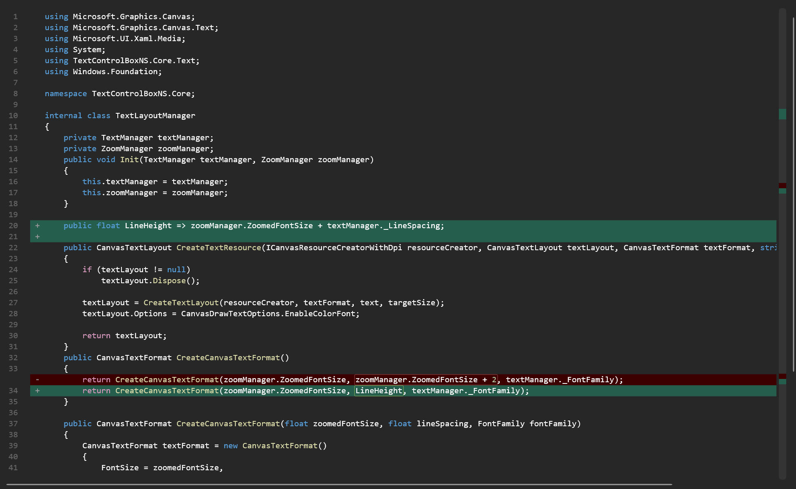

<div align="center">

<h1>TextControlBox-WinUI</h1>
</div>

<div align="center">


</div>

<br/>

## 🤔 What is TextControlBox?

TextControlBox is a high-performance, customizable text editor control for WinUI 3. It provides
viewport-based Win2D rendering, editing and selection, undo/redo, search and replace, zoom, line
numbers, and syntax highlighting for multiple programming and data languages.

This repository is a maintained fork of [FrozenAssassine/TextControlBox-WinUI](https://github.com/FrozenAssassine/TextControlBox-WinUI).
It preserves the original MIT-licensed project and keeps the control application-agnostic.

## Fork focus and changes from upstream

> **Fork focus:** extend TextControlBox into a reusable editor surface for file editors and
> diff/merge-oriented applications such as Git clients, without adding Git-, diff-, or
> application-specific data types to the control itself.

Compared with the upstream repository, this fork provides:

* **.NET 8 and current WinUI support** — retargeted to
`net8.0-windows10.0.19041.0`, Windows App SDK 2.2, and Microsoft.Windows.SDK.BuildTools 10.0.28000.2270.
* **Custom line backgrounds** — full-width backgrounds for individual lines or inclusive line
ranges, named groups, atomic replacement, overlap priorities, visible-line-only rendering, and
automatic adjustment after line insertion or removal.
* **Inline text decorations** — application-defined foregrounds, backgrounds, borders, rounded
corners, and horizontal padding for exact character ranges. Decorations are prioritized,
viewport-aware, and adjusted or clipped when document lines change.
* **A virtualized marker column** — lightweight per-line text markers with foreground and optional
background colors, intended for change indicators, diagnostics, bookmarks, and similar editor
annotations. It does not create a UI element for every document line.
* **An overview-bar content slot** — arbitrary interactive content can be hosted between the text
viewport and vertical scrollbar. The application supplies the overview bar, minimap, or other
navigation UI; the control reserves no space while the slot is empty.
* **Custom line-number labels** — sequential numbers can be replaced with application-provided
labels, including blank labels for projected or specially classified rows.
* **Incremental document change notifications** — versioned, line-oriented change batches report
edits, loads, undo, and redo without comparing complete document snapshots.
* **Stateful multi-line syntax highlighting** — syntax state is cached across lines and viewport
boundaries, then invalidated incrementally after edits. Built-in definitions use it for common
multi-line strings and comments.
* **Semantic syntax palettes** — each editor instance can override colors for roles such as
comments, keywords, control flow, types, strings, and numbers without modifying shared language
definitions.
* **Safer syntax rules** — regex matching has a finite timeout and a timed-out rule is isolated to
the affected control. C-style comment parsing no longer treats comment delimiters inside string
literals as comments, and C# control-flow keywords share a consistent semantic role.
* **Configurable line spacing and corrected geometry** — text, line numbers, markers, selection,
caret, current-line highlighting, and decorations use the same DPI-aware line geometry.
* **Automatic WinUI theme synchronization** — inherited and runtime theme changes are propagated
to editor rendering and per-control syntax palettes.
* **Rendering and compatibility fixes** — visible lines are joined without a temporary array in
the rendering hot path, decoration layers share one invalidated Win2D canvas, and the internal
input control can be activated by the Windows App SDK 2.2 XAML compiler.

The fork does not implement a diff or merge engine. Applications remain responsible for computing
line classifications, changed character ranges, overview-bar positions, and editor commands.

## 📦 Download

NuGet package:
[TextControlBox.WinUI.slow-spec85](https://www.nuget.org/packages/TextControlBox.WinUI.slow-spec85)

## Used by

* [SimpleGit11](https://github.com/slow-spec85/SimpleGit11-pub) — a WinUI Git client using the
control as a reusable editor surface. An example of a customized TextControlBox-WinUI from this project:


## 🛠️ Features

* **Viewport-based rendering**

  * Win2D rendering limited to visible document lines.
  * Batched canvas invalidation and independent decoration, selection, text, and caret layers.
* **Text editing**

  * Cut, copy, paste, select all, line operations, and programmatic selections.
  * Undo/redo with grouped actions.
  * Read-only mode, drag-and-drop input, auto-pairing, and whitespace visualization.
* **Navigation and layout**

  * Go to, select, center, and scroll specific lines.
  * Line numbers or custom line labels.
  * Configurable font, line spacing, zoom, scroll sensitivity, and caret appearance.
* **Search and replace**

  * Highlight all matches and navigate forward or backward.
  * Case-sensitive and whole-word search with single or bulk replacement.
* **Syntax highlighting**

  * Built-in definitions for programming, markup, configuration, and data formats.
  * Legacy regex rules plus stateful rules for constructs spanning multiple lines.
  * Per-control semantic palettes for light and dark themes.
  * Timeout isolation for unsafe or unexpectedly expensive regex rules.
* **Editor annotations**

  * Full-width line backgrounds with priorities and replaceable groups.
  * Foreground, background, border, rounded-corner, and padded text-range decorations.
  * Virtualized line marker gutter and custom line-number labels.
  * Right-side content slot for an application-provided overview bar or minimap.
* **Document integration**

  * Incremental, versioned `DocumentChanged` batches for edit, load, undo, and redo operations.
  * Named decoration groups for independently managed application features.

## Limits and missing features

* Word wrapping is not implemented.
* Decorations address real document lines; the control does not provide virtual projection rows or
a diff/merge model.
* The right gutter is a host for application content, not a built-in overview-bar implementation.
* Line gutter markers and custom line-number labels are application-derived projections and must be
refreshed by the consumer when edits change their line indexes.
* Legacy regex-only rules still require both delimiters of a multi-line construct to be visible.
Use stateful rules for syntax that must continue across viewport boundaries.
* Extremely large documents remain memory-intensive. A test with approximately 200 million lines
of 20 characters consumed about 20 GB and showed intermittent pauses.

## ⚠️ Common pitfalls and performance recommendations

|Scenario|Common pitfall|Recommended approach|Notes|
|-|-|-|-|
|**Initial document load**|Assigning `Text` or calling `SetText` when no undo step is wanted|Use `LoadText(...)` or `LoadLines(...)`|Load APIs replace the document and reset undo/redo history. `Text` and `SetText` record an undo action.|
|**Character or word count**|Materializing `Text` and then counting or splitting it|Use `CharacterCount()` and `WordCount()`|These methods operate on the stored lines and avoid building a full-document string.|
|**Accessing lines**|Calling `Text.Split(...)`|Use `Lines`, `NumberOfLines`, `GetLineText(...)`, or `GetLinesText(...)`|Avoids an unnecessary full-document string and split array.|
|**Saving a large document**|Calling `GetText()` unconditionally|Stream `Lines` with the required `LineEnding`; use `GetText()` only when a complete string is acceptable|`File.WriteAllLines` uses platform line endings, which may normalize an LF document. Preserve the final empty line when streaming a trailing line ending.|
|**Search and replace**|Reimplementing search over `Text`|Use `BeginSearch(...)`, `FindNext()`, `FindPrevious()`, `ReplaceNext(...)`, `ReplaceAll(...)`, and `EndSearch()`|Uses the editor's internal search indexes and highlight state.|
|**Many annotations**|Replacing a group once per decoration or creating a `FrameworkElement` for every line|Build the complete collection and call the appropriate `Set\\\*Decorations` method once|Named groups are replaced atomically; line, text, and marker rendering is limited to the viewport.|
|**Overlapping annotations**|Depending on collection enumeration order alone|Assign explicit `Priority` values and separate independent features by `groupKey`|Higher priorities are applied later. For equal priorities, later additions are applied later.|
|**Line background tracking**|Recomputing every line background after any line insertion or removal|Let `LineDecoration` ranges follow line insertions/removals; replace only when the underlying classification changes|Loading another document clears line and text-range decoration groups.|
|**Character-range tracking**|Assuming a `TextRangeDecoration` moves with character edits inside the same line|Refresh character-derived groups from `DocumentChanged`|Ranges follow inserted, removed, and swapped lines and are clipped when a line shrinks, but their columns are not semantically rebased after arbitrary character edits.|
|**Marker and label tracking**|Assuming gutter markers or custom line-number labels follow document edits|Rebuild these projections after relevant `DocumentChanged` batches|Their indexes are owned by the consumer because the control cannot infer application semantics.|
|**Overview bars and minimaps**|Adding interactive controls to the virtualized line marker gutter|Put interactive UI in `RightGutterContent`; use line gutter decorations for lightweight non-interactive markers|The right content slot is outside the text viewport and before the vertical scrollbar.|
|**Multi-line syntax**|Expressing viewport-spanning constructs only as regex rules|Add an `IStatefulHighlightRule`, or use `DelimitedHighlightRule` for literal non-nesting delimiters|Rules must be deterministic and must not store document-specific state in shared language instances.|
|**Syntax colors**|Mutating colors on a language object from the static `SyntaxHighlightings` dictionary for one editor|Set `SyntaxHighlightPalette` on that `TextControlBox` instance|Built-in language objects can be shared; palettes are isolated per control and preserve fallback colors for omitted roles.|
|**Read-only mode**|Expecting `IsReadOnly` to block all programmatic changes|Guard application commands explicitly when required|Read-only mode blocks user editing and selected edit commands; load and several programmatic line APIs intentionally remain available.|

## 🏗️ Getting started

Add the NuGet package or a project reference to a WinUI 3 application, then import the namespace:

```csharp
using TextControlBoxNS;
```

### Basic usage

```csharp
TextControlBox textBox = new();
textBox.LoadText("Hello, world!");
textBox.ShowLineNumbers = true;
textBox.EnableSyntaxHighlighting = true;
textBox.SelectSyntaxHighlightingById(SyntaxHighlightID.CSharp);
```

### Line background decorations

Use named groups to add or atomically replace line backgrounds. Line indexes are zero-based and
ranges are inclusive.

```csharp
using TextControlBoxNS.Models;
using Windows.UI;

textBox.SetLineDecorations("diagnostics", new\\\[]
{
    new LineDecoration(2, 2, Color.FromArgb(48, 255, 196, 0), priority: 10),
    new LineDecoration(8, 12, Color.FromArgb(40, 0, 120, 215), priority: 5),
});

textBox.RemoveLineDecorations("diagnostics");
textBox.ClearLineDecorations();
```

Higher priorities and later additions are painted last. Only visible intersections are resolved,
backgrounds fill the text viewport to its right edge, and ranges follow line insertion and removal.

### Text range decorations

Text range decorations use a zero-based line and the end-exclusive interval
`\\\[startColumn, startColumn + length)`.

```csharp
textBox.SetTextDecorations("merge-annotations", new\\\[]
{
    new TextRangeDecoration(
        line: 4,
        startColumn: 8,
        length: 12,
        foregroundColor: Color.FromArgb(255, 180, 40, 40),
        backgroundColor: Color.FromArgb(32, 180, 40, 40),
        borderColor: Color.FromArgb(255, 180, 40, 40),
        borderThickness: 1,
        priority: 20)
    {
        CornerRadius = 3,
        HorizontalPadding = 2,
    },
});

textBox.RemoveTextDecorations("merge-annotations");
textBox.ClearTextDecorations();
```

Foreground colors override syntax highlighting for the same range. Backgrounds and borders remain
behind selection and text. Ranges follow inserted, removed, or swapped lines and are clipped when a
line shrinks; refresh application-derived character ranges after relevant edits.

### Line markers, overview content, and custom labels

Use line gutter decorations for lightweight per-line text such as change markers, diagnostics, or
bookmarks:

```csharp
textBox.LineGutterWidth = 24;
textBox.SetLineGutterDecorations("changes", new\\\[]
{
    new LineGutterDecoration(
        line: 2,
        text: "+",
        foregroundColor: Color.FromArgb(255, 30, 130, 70),
        backgroundColor: Color.FromArgb(32, 30, 130, 70),
        priority: 10),
    new LineGutterDecoration(
        line: 8,
        text: "-",
        foregroundColor: Color.FromArgb(255, 190, 50, 50)),
});
```

The marker column shares the decoration canvas and visible-line virtualization with the editor. It
collapses when disabled or empty. Use `RightGutterContent` for an interactive overview bar:

```xml
<textControlBox:TextControlBox>
    <textControlBox:TextControlBox.RightGutterContent>
        <Border Width="12">
            <Canvas />
        </Border>
    </textControlBox:TextControlBox.RightGutterContent>
</textControlBox:TextControlBox>
```

Custom line labels replace automatic numbering until cleared:

```csharp
textBox.SetLineNumberLabels(new\\\[] { "1", "", "2", "3" });
textBox.ClearLineNumberLabels();
```

### Incremental document changes

`DocumentChanged` reports line-oriented replacements. Each batch has a monotonically increasing
version and a reason: `Edit`, `Undo`, `Redo`, or `Load`.

```csharp
textBox.DocumentChanged += (\\\_, args) =>
{
    foreach (DocumentChange change in args.Changes)
    {
        // Remove change.RemovedLineCount old lines at change.StartLine,
        // then insert change.InsertedLineCount new lines at the same index.
    }
};
```

Grouped operations publish one ordered batch. No ordering relative to the legacy `TextChanged` and
`TextLoaded` events is guaranteed.

### Stateful syntax highlighting

Languages can provide line-oriented rules whose state continues across viewport boundaries:

```csharp
language.StatefulHighlightRules = new IStatefulHighlightRule\\\[]
{
    new DelimitedHighlightRule(
        "/\\\*",
        "\\\*/",
        "#6B6A6A",
        "#646464",
        role: SyntaxHighlightRole.Comment),
};

textBox.SyntaxHighlighting = language;
```

State is cached per editor and recalculated incrementally after document changes; only visible
lines produce highlight spans. `DelimitedHighlightRule` handles literal, non-nesting delimiters.
Grammar-aware languages can implement `IStatefulHighlightRule` directly.

### Semantic syntax palettes

Applications can override semantic colors for one control without changing its language rules:

```csharp
textBox.SyntaxHighlightPalette = new SyntaxHighlightPalette(
    new SyntaxHighlightPaletteEntry(
        SyntaxHighlightRole.Comment,
        Color.FromArgb(255, 0, 128, 0),
        Color.FromArgb(255, 106, 153, 85)),
    new SyntaxHighlightPaletteEntry(
        SyntaxHighlightRole.Keyword,
        Color.FromArgb(255, 0, 0, 255),
        Color.FromArgb(255, 86, 156, 214)),
    new SyntaxHighlightPaletteEntry(
        SyntaxHighlightRole.String,
        Color.FromArgb(255, 163, 21, 21),
        Color.FromArgb(255, 206, 145, 120)));
```

Roles omitted from the palette retain the colors supplied by the language. Custom regex and
stateful rules default to `SyntaxHighlightRole.Custom`, which always uses the rule's own colors.

### Rendering order

The editor uses the following visual order, from back to front:

1. Control and line-number backgrounds.
2. Marker-column backgrounds and line background decorations.
3. Current-line highlight.
4. Text-range backgrounds and borders.
5. Selection.
6. Search highlights, syntax/user foreground colors, and text glyphs.
7. Caret.

Line numbers use their own canvas. The marker column and text decoration backgrounds share one
canvas so they scroll and invalidate as a single frame.

<details>

<summary><h2>🛠️ All properties and functions</h2></summary>

### Properties

|Property|Description|
|-|-|
|`Text`|Gets or sets the complete document. Setting it records an undo action.|
|`Lines`|Enumerates the stored document lines without splitting `Text`.|
|`SelectedText`|Gets or sets the currently selected text.|
|`CurrentSelection` / `CurrentSelectionOrdered`|Gets selection metadata in original or document order.|
|`HasSelection`|Indicates whether a non-empty selection exists.|
|`CursorPosition`|Gets or sets the current zero-based line and character position.|
|`CurrentLineIndex`|Gets the zero-based line containing the caret.|
|`NumberOfLines`|Gets the total number of document lines.|
|`LineEnding`|Gets or sets the document line-ending style.|
|`IsReadOnly`|Gets or sets whether user editing and guarded edit commands are disabled.|
|`CanUndo` / `CanRedo`|Indicates whether undo or redo is currently available.|
|`UndoRedoEnabled`|Enables or disables undo/redo recording and commands.|
|`IsGroupingActions`|Indicates whether an undo/redo action group is open.|
|`SearchIsOpen`|Indicates whether an internal search session is active.|
|`FontFamily`|Gets or sets the editor font family.|
|`FontSize`|Gets or sets the base font size.|
|`RenderedFontSize`|Gets the font size after zoom is applied.|
|`LineSpacing`|Gets or sets additional line spacing in DIPs; the default is `2`.|
|`ActualLineHeight`|Gets the rendered line height.|
|`TextColor`|Gets or sets the default text color.|
|`CornerRadius`|Gets or sets the control corner radius.|
|`RequestedTheme`|Gets or sets the WinUI theme; rendering follows the resulting `ActualTheme`.|
|`Design`|Gets or sets the editor color and brush configuration.|
|`ShowLineNumbers`|Shows or hides the line-number column.|
|`SpaceBetweenLineNumberAndText`|Gets or sets spacing between line numbers and editor content.|
|`ShowLineHighlighter`|Enables the current-line background.|
|`HighlightLineWhenNotFocused`|Keeps the current-line background visible without focus.|
|`ShowWhitespaceCharacters`|Shows visual markers for spaces and tabs.|
|`CursorSize`|Gets or sets custom caret dimensions and offsets.|
|`ZoomFactor`|Gets or sets the zoom percentage.|
|`EnableSyntaxHighlighting`|Enables or disables syntax rendering.|
|`SyntaxHighlighting`|Gets or sets the current language definition.|
|`SyntaxHighlightPalette`|Gets or sets semantic color overrides for this control.|
|`SyntaxHighlightings`|Static dictionary of built-in language definitions by `SyntaxHighlightID`.|
|`HighlightLinks`|Enables link highlighting and click handling.|
|`RightGutterContent`|Gets or sets content hosted before the vertical scrollbar.|
|`ShowLineGutter`|Enables or disables the virtualized marker column.|
|`LineGutterWidth`|Gets or sets marker-column width in DIPs; the default is `24`.|
|`ScrollBarPosition`|Gets or sets both scroll offsets.|
|`VerticalScroll` / `HorizontalScroll`|Gets or sets individual scroll offsets.|
|`VerticalScrollSensitivity` / `HorizontalScrollSensitivity`|Gets or sets wheel-scroll sensitivity.|
|`SelectionScrollStartBorderDistance`|Gets or sets the edge zones that trigger selection auto-scroll.|
|`UseSpacesInsteadTabs`|Gets or sets whether indentation inserts spaces.|
|`NumberOfSpacesForTab`|Gets or sets the indentation width.|
|`DoAutoPairing`|Enables automatic bracket and quote pairing.|
|`AutoPairOnlyOnSelection`|Restricts auto-pairing to surrounding selected text.|
|`ControlW\\\_SelectWord`|Enables Ctrl+W word selection.|
|`ContextFlyout`|Gets or sets the editor context menu.|
|`ContextFlyoutDisabled`|Disables the context menu when set.|

### Text, selection, and clipboard methods

|Method|Description|
|-|-|
|`LoadText(string text, bool autodetectTabsSpaces = true)`|Replaces the document and resets undo/redo history.|
|`LoadLines(IEnumerable<string> lines, bool autodetectTabsSpaces = true, LineEnding lineEnding = LineEnding.CRLF)`|Loads lines without first constructing a complete text string.|
|`SetText(string text)`|Replaces the text and records an undo action.|
|`GetText()`|Returns the complete document as one string.|
|`GetLineText(int line)`|Returns one zero-based line.|
|`GetLinesText(int startLine, int length)`|Returns a joined range of lines.|
|`SetLineText(int line, string text)`|Replaces one line and records an undo action.|
|`AddLine(int line, string text)` / `AddLines(int start, string\\\[] text)`|Inserts one or more lines and records undo.|
|`DeleteLine(int line)`|Deletes one line and records undo.|
|`DuplicateLine(int line, bool ignoreIsReadOnly = false)`|Duplicates a specified line.|
|`DuplicateCurrentLine(bool ignoreIsReadOnly = false)`|Duplicates the caret line.|
|`Paste()` / `Copy()` / `Cut()`|Executes the corresponding clipboard operation.|
|`SetSelection(int start, int length)`|Sets a selection by full-document character index.|
|`SelectLine(int line)` / `SelectLines(int start, int count)`|Selects complete document lines.|
|`SelectAll()` / `ClearSelection()`|Selects all content or clears selection.|
|`SurroundSelectionWith(string text)`|Surrounds selected text with the same prefix and suffix.|
|`SurroundSelectionWith(string text1, string text2)`|Surrounds selected text with different prefix and suffix.|
|`CalculateSelectionPosition()`|Returns full-document index and length for the current selection.|
|`CharacterCount()` / `WordCount()`|Counts stored characters or words without materializing `Text`.|

### Undo, indentation, search, and navigation methods

|Method|Description|
|-|-|
|`Undo()` / `Redo()`|Reverts or reapplies the latest undo item.|
|`ClearUndoRedoHistory()`|Clears both histories.|
|`ExecuteActionGroup(Action actionGroup)`|Executes multiple operations as one undo/redo item.|
|`BeginActionGroup()` / `EndActionGroup()`|Manually brackets operations into one undo/redo item.|
|`DetectTabsSpaces()`|Returns the detected indentation mode and width.|
|`RewriteTabsSpaces(int spaces, bool useSpacesInsteadTabs, bool ignoreIsReadOnly = false)`|Converts indentation throughout the document.|
|`BeginSearch(string word, bool wholeWord, bool matchCase)`|Starts a highlighted search and returns its initial result.|
|`FindNext()` / `FindPrevious()`|Navigates the current search results.|
|`ReplaceNext(string replaceWord, bool ignoreIsReadOnly = false)`|Replaces the next current-search match.|
|`ReplaceAll(string word, string replaceWord, bool matchCase, bool wholeWord, bool ignoreIsReadOnly = false)`|Replaces all matching text.|
|`EndSearch()`|Ends the search and removes its highlights.|
|`Focus(FocusState state)`|Focuses the editor.|
|`GoToLine(int line)`|Moves the caret to the beginning of a line.|
|`SetCursorPosition(int lineNumber, int characterPos, bool scrollIntoView = true, bool autoClamp = true)`|Sets the zero-based caret position.|
|`GetCursorPosition()`|Returns the rendered caret coordinates as a `Point`.|
|`ScrollLineToCenter(int line)`|Centers a line if it is outside the rendered region.|
|`ScrollLineIntoView(int line)`|Brings a line into the viewport.|
|`ScrollOneLineUp()` / `ScrollOneLineDown()`|Scrolls vertically by one line.|
|`ScrollPageUp()` / `ScrollPageDown()`|Scrolls vertically by one page.|
|`ScrollTopIntoView()` / `ScrollBottomIntoView()`|Scrolls to the document boundaries.|
|`ScrollIntoViewHorizontally()`|Brings the caret into horizontal view.|

### Annotation and syntax methods

|Method|Description|
|-|-|
|`SetLineDecorations(string groupKey, IEnumerable<LineDecoration> decorations)`|Atomically sets a named line-background group.|
|`RemoveLineDecorations(string groupKey)` / `ClearLineDecorations()`|Removes one or all line-background groups.|
|`SetTextDecorations(string groupKey, IEnumerable<TextRangeDecoration> decorations)`|Atomically sets a named text-range group.|
|`RemoveTextDecorations(string groupKey)` / `ClearTextDecorations()`|Removes one or all text-range groups.|
|`SetLineGutterDecorations(string groupKey, IEnumerable<LineGutterDecoration> decorations)`|Atomically sets a named marker-column group.|
|`RemoveLineGutterDecorations(string groupKey)` / `ClearLineGutterDecorations()`|Removes one or all marker groups.|
|`SetLineNumberLabels(IEnumerable<string> labels)` / `ClearLineNumberLabels()`|Sets custom labels or restores sequential line numbers.|
|`SelectSyntaxHighlightingById(SyntaxHighlightID languageId)`|Selects a built-in language.|
|`GetSyntaxHighlightingFromID(SyntaxHighlightID languageId)`|Static lookup for a built-in language definition.|
|`GetSyntaxHighlightingFromJson(string json)`|Static loader for a legacy JSON language definition.|
|`Unload()`|Releases editor resources; the instance must not be used afterwards.|

</details>

## 🚀 Events

|Event|Description|
|-|-|
|`TextChanged`|Raised when text content changes.|
|`DocumentChanged`|Raised after a versioned batch of line replacements with `DocumentChangeReason`.|
|`SelectionChanged`|Raised when the current selection changes.|
|`ZoomChanged`|Raised when the zoom factor changes.|
|`GotFocus` / `LostFocus`|Raised when the editor gains or loses focus.|
|`Loaded`|Raised after the control and its internal components are initialized.|
|`TextLoaded`|Raised after `LoadText` or `LoadLines` completes; it is not raised by `SetText`.|
|`TabsSpacesChanged`|Raised when detected or configured indentation settings change.|
|`LineEndingChanged`|Raised when the document line-ending mode changes.|
|`LinkClicked`|Raised with the URL when a highlighted link is clicked.|

## 🎨 Syntax highlighting

Built-in definitions include x86 Assembly, Batch, C++, C#, CSS, CSV, G-Code, Gitignore, Hex,
HTML, INI/Klipper configuration, Java, JavaScript, JSON, LaTeX, Lua, Markdown, PHP, Python, Q#,
SQL, TOML, and XML.

```csharp
textBox.SelectSyntaxHighlightingById(SyntaxHighlightID.CSharp);
```

## 👨‍👩‍👧‍👦 Contributing

Contributions are welcome. Feel free to submit a pull request or open an issue.

## 🧾 License

This project is licensed under the MIT License.

